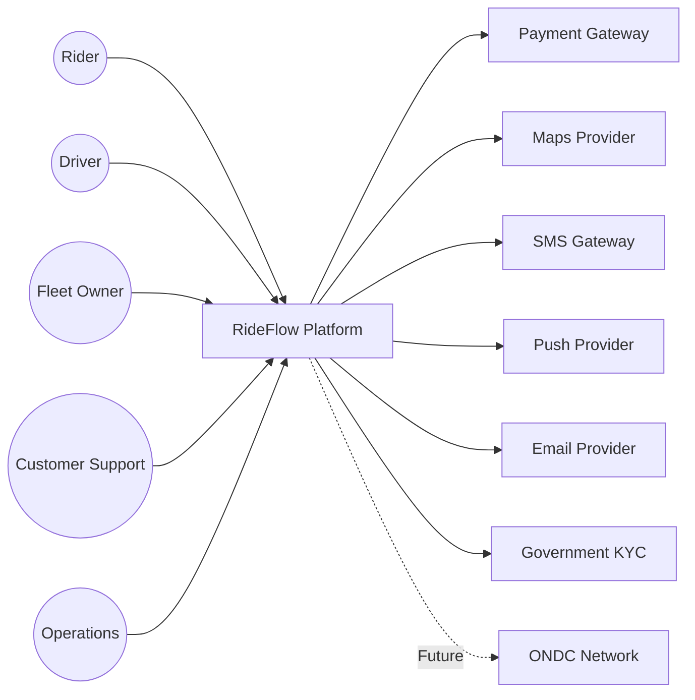

---

id: RF-C4-001
title: RideFlow C4 Model - Level 1 - System Context
version: 1.0
status: Approved
owner: Solution Architecture Team
reviewers:

* Enterprise Architecture
* Product Team
  last_updated: 2026-06-29

---

# RideFlow C4 Model — Level 1 (System Context)

> *"The System Context diagram answers one question: What surrounds RideFlow?"*

---

# Purpose

The System Context diagram provides a high-level view of RideFlow and its interactions with external users and systems.

It is intended for business stakeholders, product managers, architects, technical leads, and engineering teams to establish a common understanding of the system boundary.

This diagram intentionally omits internal implementation details.

---

# Scope

The System Context diagram illustrates:

* Primary users
* External systems
* Trust boundaries
* High-level interactions

It does **not** describe containers, components, databases, or deployment.

---

# Primary Actors

## Rider

Uses RideFlow to:

* Register
* Book rides
* Track rides
* Make payments
* Submit ratings

---

## Driver

Uses RideFlow to:

* Register
* Complete KYC
* Accept rides
* Navigate
* Receive payouts

---

## Fleet Owner

Uses RideFlow to:

* Manage drivers
* Monitor vehicles
* Review fleet performance

---

## Operations Team

Uses RideFlow to:

* Monitor platform health
* Manage incidents
* Configure operational settings

---

## Customer Support

Uses RideFlow to:

* Resolve disputes
* Process refunds
* Review ride history

---

# External Systems

## Payment Gateway

Responsibilities

* Payment authorization
* Payment capture
* Refund processing

---

## Maps Provider

Responsibilities

* Geocoding
* Routing
* Distance calculation
* ETA estimation

---

## SMS Gateway

Responsibilities

* OTP delivery
* Transactional SMS

---

## Push Notification Provider

Responsibilities

* Mobile push notifications

---

## Email Provider

Responsibilities

* Receipts
* Driver onboarding
* Account notifications

---

## Government KYC Service

Responsibilities

* Identity verification
* Document validation

---

## ONDC Network (Future)

Responsibilities

* Ride discovery
* Order interoperability
* Open ecosystem integration

---

# System Context Diagram

---

# Trust Boundaries

## Internal

* RideFlow Platform

## External

* Payment Gateway
* Maps Provider
* Notification Providers
* Government Services
* ONDC

Communication with external systems must use secure, authenticated APIs.

---

# Architectural Decisions

* RideFlow owns business workflows.
* External systems provide specialized capabilities.
* No external provider owns RideFlow business logic.
* Business-critical decisions remain inside RideFlow.

---

# Quality Attribute Considerations

Availability

RideFlow should degrade gracefully if an external provider becomes unavailable.

Performance

External integrations should not block critical workflows unnecessarily.

Security

All external communication must use authenticated and encrypted channels.

Reliability

Transient failures should be retried where appropriate.

---

# Architect's Lens

Questions

1. Which external dependency introduces the greatest business risk?
2. Which external systems require fallback strategies?
3. Which integrations should be synchronous?
4. Which integrations could become asynchronous?

---

# Traceability

Business Vision
→ External Business Partners
→ System Context
→ Container Architecture

---

# Conclusion

The System Context establishes the architectural boundary of RideFlow and provides the foundation for the Container Diagram (C4 Level 2), where the internal structure of the platform will be described.
