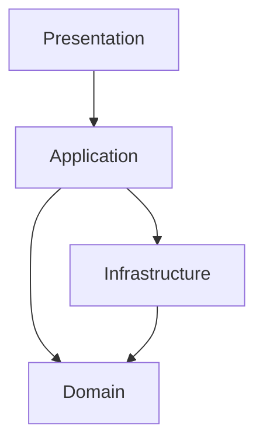

---

id: RF-C4-003
title: RideFlow C4 Model - Level 3 - Component Diagram
version: 1.0
status: Approved
owner: Solution Architecture Team
last_updated: 2026-06-29
------------------------

# RideFlow C4 Model — Level 3 (Component Diagram)

> *"Components explain how a container is organized internally."*

---

# Purpose

This document decomposes the **RideFlow API** container into logical components aligned with Clean Architecture, Domain-Driven Design, and the Modular Monolith approach.

---

# Architectural Style

The RideFlow API follows **Clean Architecture** with **Vertical Slice Architecture** for application features.

```text
Presentation Layer
        │
        ▼
Application Layer
        │
        ▼
Domain Layer
        │
        ▼
Infrastructure Layer
```

---

# Major Components

## Presentation Layer

* REST Controllers
* Authentication Middleware
* Validation
* API Versioning
* OpenAPI / Swagger

---

## Application Layer

* Commands
* Queries
* Handlers
* DTOs
* Validators
* Application Services

---

## Domain Layer

Business modules:

* Identity
* Rider
* Driver
* Ride
* Pricing
* Payments
* Subscription
* Notifications
* Support
* Analytics

Each module contains:

* Aggregates
* Entities
* Value Objects
* Domain Services
* Domain Events
* Policies

---

## Infrastructure Layer

* Entity Framework Core
* PostgreSQL
* Redis
* Blob Storage
* External API Clients
* Logging
* Messaging Adapters

---

# Component Relationship



---

# Dependency Rules

* Presentation never accesses Infrastructure directly.
* Domain has no dependency on Infrastructure.
* Infrastructure implements interfaces defined by the Domain or Application layers.
* Cross-module interaction occurs through application services or domain events—not direct entity references.

---

# Cross-Cutting Components

* Authentication & Authorization
* Validation
* Logging
* Observability
* Exception Handling
* Feature Flags
* Configuration
* Health Checks

---

# Component Ownership

| Component     | Owner                  |
| ------------- | ---------------------- |
| Identity      | Platform Team          |
| Ride          | Mobility Team          |
| Driver        | Driver Platform Team   |
| Payments      | Finance Platform Team  |
| Notifications | Platform Services Team |
| Analytics     | Data Platform Team     |

---

# Evolution

As RideFlow scales, each business module can be extracted into an independent service while preserving the same internal architectural principles.

The internal component model therefore becomes the blueprint for future service decomposition.

---

# Conclusion

The Component Diagram demonstrates that architectural modularity is achieved through disciplined design—not through the number of deployable services.

RideFlow Version 1.0 achieves separation of concerns through modules, clear dependency rules, and domain boundaries while remaining operationally simple as a Modular Monolith.
